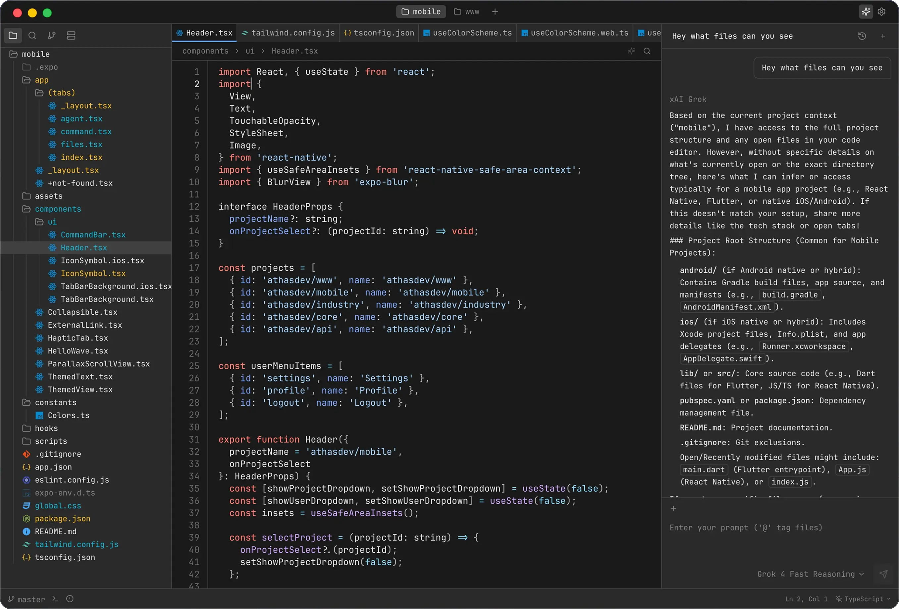

  
  <h1>Athas</h1>
  
A lightweight, cross-platform code editor, built with <a href="https://tauri.app/" title="Tauri">Tauri</a> (Rust and React) with Git support, AI agents, vim keybindings.

  

## Features

- External editor support (Neovim, Helix, etc.)
- Git integration
- AI agents
- Terminal

## Download

Get the latest version from the [releases page](https://github.com/athasdev/athas/releases).

## Documentation

See the [documentation](https://athas.dev/docs).

## Contributing

Contributions are welcome! See the [contributing guide](CONTRIBUTING.md).

## Support

- [Issues](https://github.com/athasdev/athas/issues)
- [Discussions](https://github.com/athasdev/athas/discussions)
- [Discord](https://discord.gg/55nmWmQwKw)

## License

[AGPL-3.0](LICENSE)
